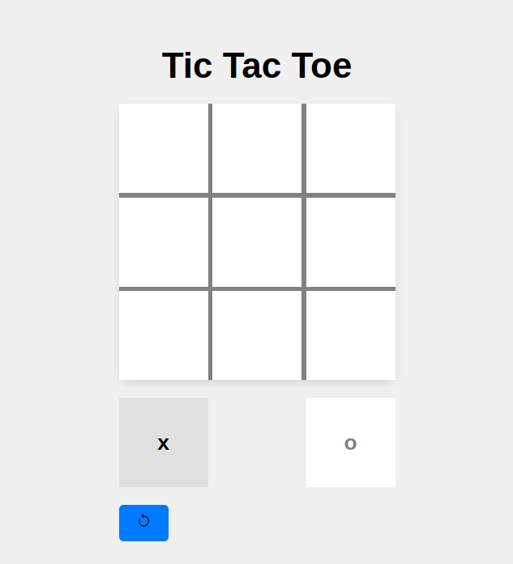

# Documento de Desarrollo: Tic Tac Toe Game

## Descripción del Proyecto

**Nombre del Proyecto:** Tic Tac Toe Game

**Descripción:** Este proyecto es mi primera incursión en el desarrollo con React. Se trata de un juego sencillo de 3 en raya (Tic Tac Toe), donde dos jugadores se turnan para marcar sus movimientos en una cuadrícula de 3x3. El juego determina quién gana, quién pierde y si hay empates.

## Mejoras
- Opción de jugar contra una IA.
- Modo Oscuro.
- Algunas mejoras visualez y refactorización del codigo.
- Añadir sonido
- Puntuación

## Características Principales

- Juego de 3 en raya interactivo para dos jugadores.
- Anuncia al ganador o si hay empate al final del juego.
- Diseño minimalista y agradable a la vista.

## Tecnologías Utilizadas

- React: Para la construcción de la interfaz y la lógica del juego.
- CSS: Para los estilos y diseño visual del juego.
- JavaScript: Para la programación de la lógica de juego.
- Git: Control de versiones para el desarrollo.
- GitHub: Plataforma para alojar y compartir el código fuente.

## Conclusiones

Este proyecto me permitió familiarizarme con el desarrollo en React y practicar la construcción de componentes reutilizables, la gestión de estados y la interacción entre componentes. Además, me brindó la oportunidad de aprender sobre el diseño y la organización de proyectos en React, así como también la importancia de las pruebas y la depuración.

Aunque el juego es sencillo, representa un primer paso importante en mi camino de aprendizaje en el desarrollo web con React.
